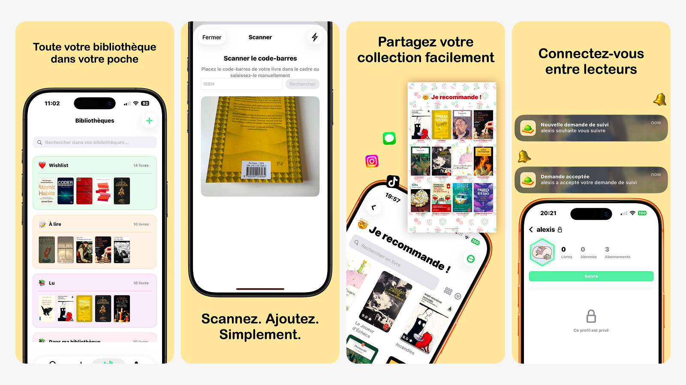

# Hi, I'm Alaikssi! 👋

**Freelance iOS Developer (SwiftUI) & Full Stack (Next.js)** based in Lyon, France 🇫🇷

---

## 🚀 What I Do

I help startups and businesses transform ideas into **published App Store products**.

Unlike traditional mobile developers, I handle the **entire stack**:

- 📱 **iOS Native:** High-performance apps using **SwiftUI**, Combine, and CoreData.
- 🌐 **Backend & Web:** Admin dashboards and APIs using **Node.js**, and React.
- 🚀 **Deployment:** App Store submission, CI/CD, and Cloud infrastructure.

---

## 🏆 Featured Project: Bookster

*An iOS application to manage your book collection with real-time barcode scanning.*

  

**Technical Highlights:**

- **Vision Framework:** Instant ISBN barcode recognition.
- **SwiftUI & MVVM:** Clean architecture for smooth UI.
- **API Integration:** Fetching metadata from external book APIs.
- **Social Features:** Share and discover books with other users.

---

## 🛠 Tech Stack

### Mobile & Core
   

### Web & Backend
     

### Tools & DevOps
   

---

  
🎓 Engineer Graduated from <a href="https://eseo.fr/">ESEO</a> | 📍 Lyon, France

